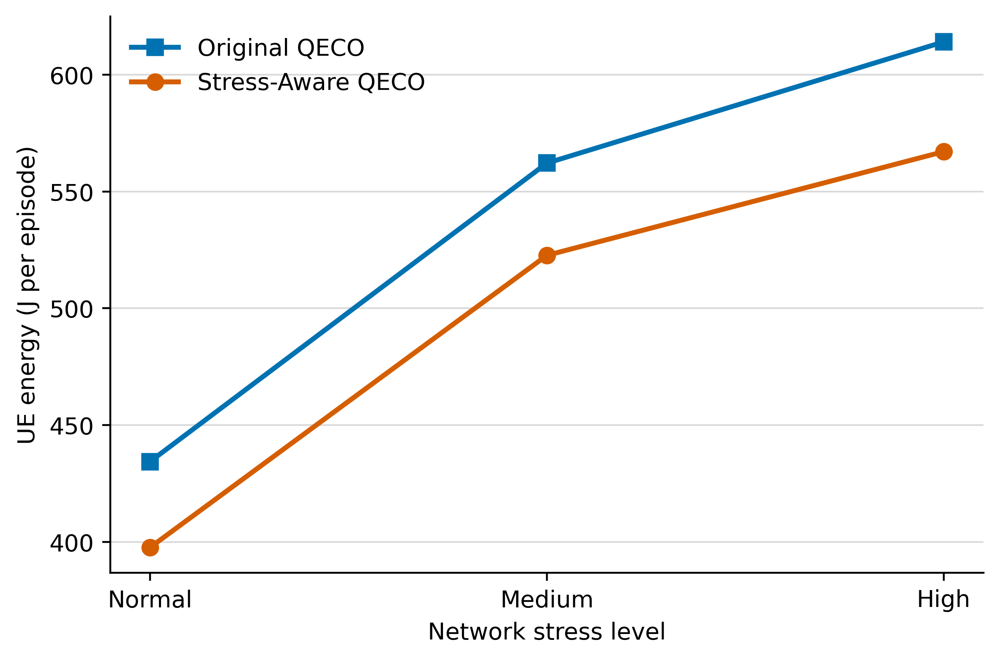
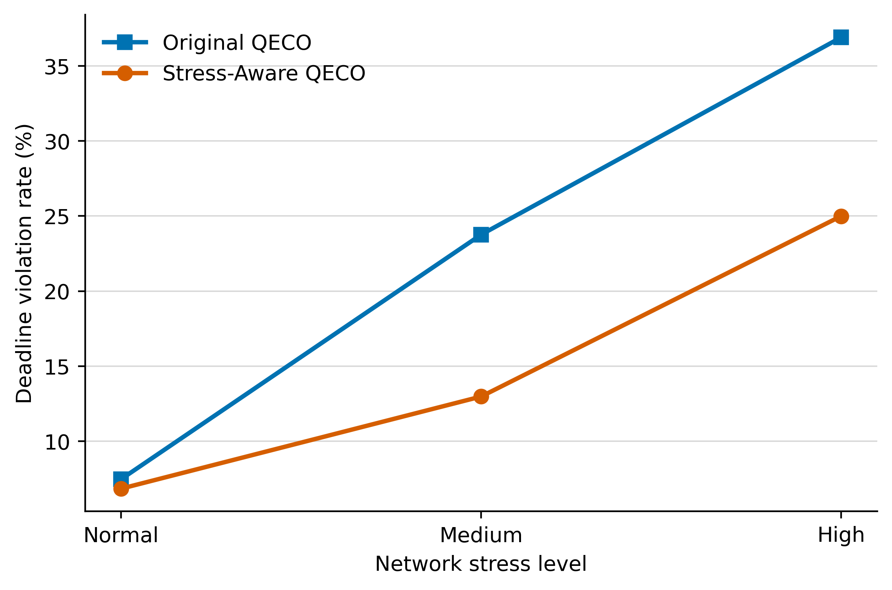
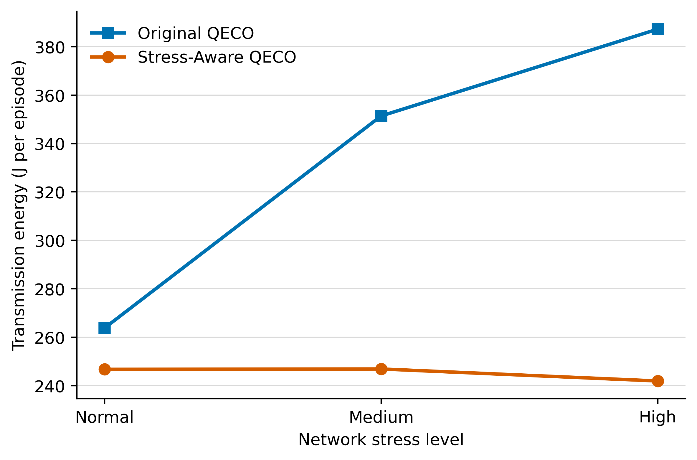
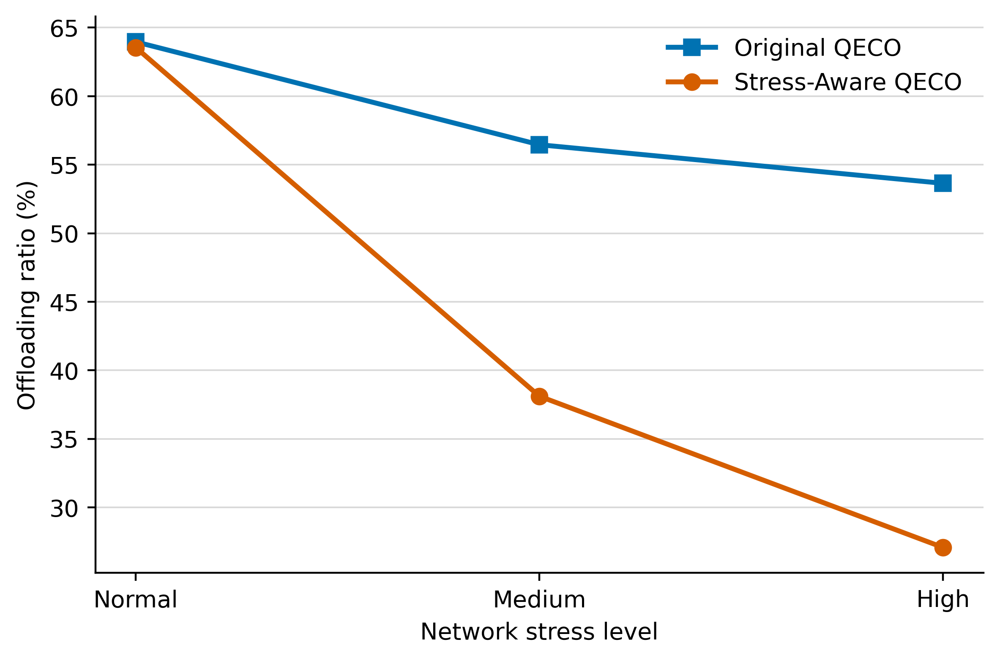

# Original QECO versus Stress-Aware QECO

All values use 1,000 matched episodes and the frozen methodology.

## Final results

| Stress | Method | UE energy (J/episode) | System energy (J/episode) | TX energy (J/episode) | Violations | Violation rate | Time-to-terminal (s) | Offloading ratio |
|---|---|---:|---:|---:|---:|---:|---:|---:|
| Normal | Original QECO | 434.376 | 488.910 | 263.795 | 44,911 | 7.47% | 0.5933 | 63.96% |
| Normal | Stress-Aware QECO | **397.618** | **455.805** | **246.729** | **41,102** | **6.84%** | 0.6041 | 63.54% |
| Medium | Original QECO | 562.167 | 593.871 | 351.388 | 142,833 | 23.76% | 0.7247 | 56.45% |
| Medium | Stress-Aware QECO | **522.685** | **554.444** | **246.872** | **77,999** | **12.97%** | **0.6975** | 38.11% |
| High | Original QECO | 614.073 | 629.326 | 387.240 | 221,820 | 36.90% | 0.7695 | 53.64% |
| High | Stress-Aware QECO | **567.089** | **577.113** | **241.910** | **150,257** | **24.99%** | 0.7775 | 27.08% |

## Matched offloading energy savings

| Stress | Original saving | Stress-aware saving | Stress-aware saving across episodes |
|---|---:|---:|---:|
| Normal | 28.25% | **37.66%** | 149,971.15 J |
| Medium | -8.54% | **+4.91%** | +12,759.04 J |
| High | -26.54% | **-21.75%** | -43,221.83 J |

Medium-stress positive savings were restored. At High stress, overall UE energy, system energy, transmission energy, and violation rate improved, but positive per-task offloading savings were physically infeasible under the locked power/capacity assumptions.

## Override transitions

| Stress | Local→Edge | Edge→Local | Edge 0→Edge 1 | Edge 1→Edge 0 |
|---|---:|---:|---:|---:|
| Normal | 117,697 | 133,666 | 67,853 | 48,562 |
| Medium | 40,314 | 216,960 | 34,934 | 20,650 |
| High | 9,460 | 265,141 | 9,126 | 4,128 |

## Figures

**Figure 1.** Mean UE-only energy under Original and Stress-Aware QECO.

**Figure 2.** Pooled deadline violation rate under increasing network stress.

**Figure 3.** Mean UE transmission energy per episode.

**Figure 4.** Fraction of arriving tasks routed to either edge server.

## Results-section findings

See `FINAL_FINDINGS.md` for seven concise findings suitable for the paper.
